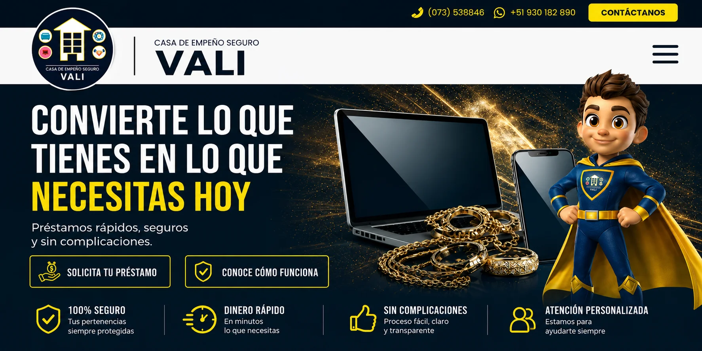

<p align="center">
  <a href="https://report-notebook-young-stone-9766.fly.dev/login">
    
  </a>
</p>

# 🏦 Plataforma Web Corporativa - Casa de Empeño Seguro VALI


## 📋 Descripción del Proyecto

Plataforma web corporativa diseñada y desarrollada para **Casa de Empeño Seguro VALI**, con el objetivo de fortalecer la presencia digital de la empresa y optimizar la comunicación con sus clientes. El sitio web presenta los servicios de la empresa de manera clara y profesional, facilitando el acceso a información relevante y mejorando la experiencia del usuario.

## 🚀 Características Principales

### 🎨 Diseño y Desarrollo Frontend
- **Arquitectura moderna**: Implementada con PHP, JavaScript, HTML5 y CSS3
- **Framework CSS**: Bootstrap para un diseño responsive y consistente
- **Interfaz intuitiva**: Navegación optimizada para una experiencia de usuario fluida

### 📱 Responsive Design
- Adaptación completa a dispositivos móviles, tablets y escritorio
- Pruebas de usabilidad en múltiples resoluciones y navegadores
- Experiencia consistente en cualquier dispositivo

### 📝 Funcionalidades Personalizadas
- **Formularios de contacto**: Canales directos para consultas y solicitudes
- **Módulos informativos**: Presentación estructurada de servicios y promociones
- **Interacciones dinámicas**: Mejora en la comunicación con el cliente

### 🚀 Optimización y Rendimiento
- **Velocidad de carga**: Optimización de recursos y código
- **SEO Técnico**: Implementación de estrategias para mejorar el posicionamiento en buscadores
- **Buenas prácticas**: Código limpio, mantenible y escalable

### 🔧 Control de Versiones
- Gestión del proyecto mediante **Git**
- Seguimiento de cambios y colaboración eficiente
- Mantenimiento continuo y actualizaciones periódicas

## 🛠️ Tecnologías Utilizadas

| Tecnología | Propósito |
|------------|-----------|
| **PHP** | Lógica backend y procesamiento de datos |
| **JavaScript** | Interactividad y funcionalidades dinámicas |
| **HTML5** | Estructura semántica del contenido |
| **CSS3** | Estilización y diseño visual |
| **Bootstrap** | Framework CSS para diseño responsive |
| **Git** | Control de versiones y colaboración |

## 📸 Capturas de Pantalla

*[Agregar imágenes del proyecto aquí]*

## 🔧 Instalación y Configuración

1. Clonar el repositorio:
```bash
git clone https://github.com/jsantur/webCesVali.git
